# ❤️ Heart Disease Prediction using MLOps 
# (Name: Hari Prasad joshi ID: 2024AC05924)

---

# Project Overview

This project demonstrates an **end-to-end Machine Learning Operations (MLOps)** pipeline for predicting the presence of heart disease using the Cleveland Heart Disease dataset.

The project covers the complete ML lifecycle including:

- Data acquisition
- Data preprocessing
- Model training
- Experiment tracking using MLflow
- Model evaluation
- REST API development using FastAPI
- Docker containerization
- Google Cloud Run deployment
- Kubernetes deployment manifests
- Monitoring using Prometheus & Grafana
- Automated testing using Pytest
- CI/CD using GitHub Actions

---

# Objectives

The objectives of this project are:

- Develop an accurate Heart Disease Prediction model.
- Track ML experiments using MLflow.
- Package the application using Docker.
- Deploy the application on Google Cloud Run.
- Create Kubernetes manifests for deployment.
- Monitor API health using Prometheus and Grafana.
- Automate testing and deployment using GitHub Actions.

---

# Project Architecture

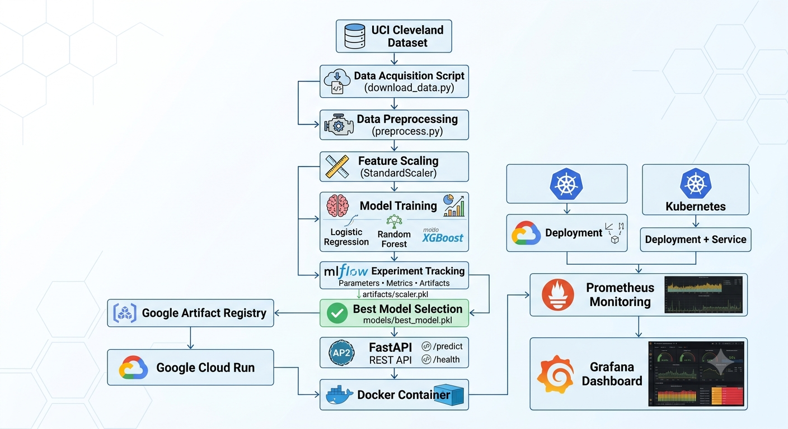

                     Heart Disease Dataset
                              │
                              ▼
                    Data Preprocessing
                              │
                              ▼
                     Feature Engineering
                              │
                              ▼
                       Model Training
                              │
                              ▼
                     MLflow Experiment
                              │
                              ▼
                      Best Model Saved
                              │
                              ▼
                        FastAPI Service
                              │
                              ▼
                     Docker Container
                              │
               ┌──────────────┴───────────────┐
               ▼                              ▼
        Google Cloud Run              Kubernetes
               │                              │
               └──────────────┬───────────────┘
                              ▼
                    Prometheus Monitoring
                              │
                              ▼
                     Grafana Dashboard
---
# Technologies Used
| Technology        | Purpose                 |
| ----------------- | ----------------------- |
| Python 3.12       | Programming Language    |
| Pandas            | Data Processing         |
| NumPy             | Numerical Computing     |
| Scikit-learn      | Machine Learning        |
| XGBoost           | Classification Model    |
| MLflow            | Experiment Tracking     |
| FastAPI           | REST API                |
| Uvicorn           | API Server              |
| Docker            | Containerization        |
| Google Cloud Run  | Deployment              |
| Artifact Registry | Docker Image Storage    |
| Kubernetes        | Container Orchestration |
| Prometheus        | Monitoring              |
| Grafana           | Visualization           |
| Pytest            | Testing                 |
| Flake8            | Code Quality            |
| GitHub Actions    | CI/CD                   |
---
# Dataset
Dataset Used:

    UCI Cleveland Heart Disease Dataset

Features include:

    Age
    Sex
    Chest Pain Type
    Resting Blood Pressure
    Cholesterol
    Fasting Blood Sugar
    Rest ECG
    Maximum Heart Rate
    Exercise Induced Angina
    Old Peak
    Slope
    Number of Major Vessels
    Thalassemia

    Target:

        0 → No Heart Disease
        1 → Heart Disease
---
# Project Structure

HariMLOpsAssgn1/

├── api/
│   └── app.py
│
├── artifacts/
│   ├── scaler.pkl
│   └── model_metadata.json
│
├── data/
│   ├── raw/
│   └── processed/
│
├── k8s/
│   ├── deployment.yaml
│   └── service.yaml
│
├── models/
│   └── best_model.pkl
│
├── notebooks/
│
├── prometheus/
│   └── prometheus.yml
│
├── src/
│   ├── download_data.py
│   ├── preprocess.py
│   ├── train.py
│   ├── evaluate.py
│   ├── pipeline.py
│   └── utils.py
│
├── tests/
│   ├── test_api.py
│   ├── test_model.py
│   └── test_pipeline.py
│
├── Dockerfile
├── docker-compose.yml
├── requirements.txt
├── README.md
└── OpenSpec.md
---
# Data Preprocessing
The preprocessing pipeline performs:

    Missing value handling
    Data cleaning
    Binary target conversion
    Train-Test Split
    Feature Scaling using StandardScaler
    Saving fitted scaler for inference

    Artifacts generated:
        artifacts/scaler.pkl
---
# Model Training
    The following machine learning models were trained:

    Logistic Regression
    Random Forest Classifier
    XGBoost Classifier

    Evaluation metrics:

    Accuracy
    Precision
    Recall
    F1 Score
    ROC-AUC

The best performing model is automatically saved as:
    models/best_model.pkl
---
# MLflow Experiment Tracking
    MLflow is used to record:

    Parameters
    Metrics
    Model Artifacts
    Best Model
    Experiment Runs

    Start MLflow locally:
    mlflow ui
        Open: http://localhost:5000

Screenshot MLFlow
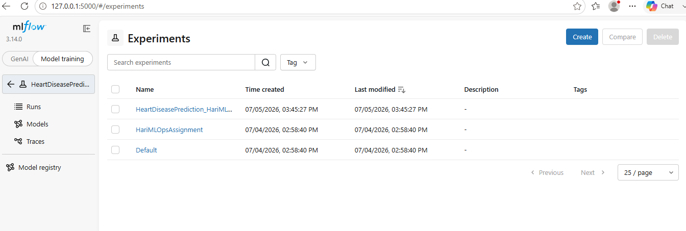
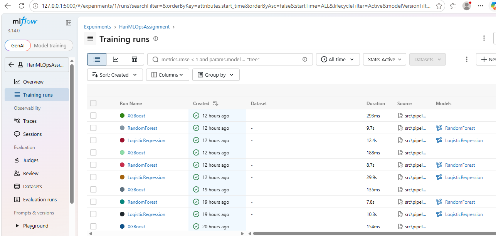
---
# FastAPI
    The trained model is exposed as a REST API using FastAPI.

    command ran locally:

    uvicorn api.app:app --reload

    Swagger UI:

    http://localhost:8000/docs

    Endpoints:

        Health Check
        GET /health
        Metrics
        GET /metrics        
        Prediction
        POST /predict

    Example Request:

            {
            "age": 63,
            "sex": 1,
            "cp": 3,
            "trestbps": 145,
            "chol": 233,
            "fbs": 1,
            "restecg": 0,
            "thalach": 150,
            "exang": 0,
            "oldpeak": 2.3,
            "slope": 0,
            "ca": 0,
            "thal": 1
            }
    FastAPI ScreenShots
            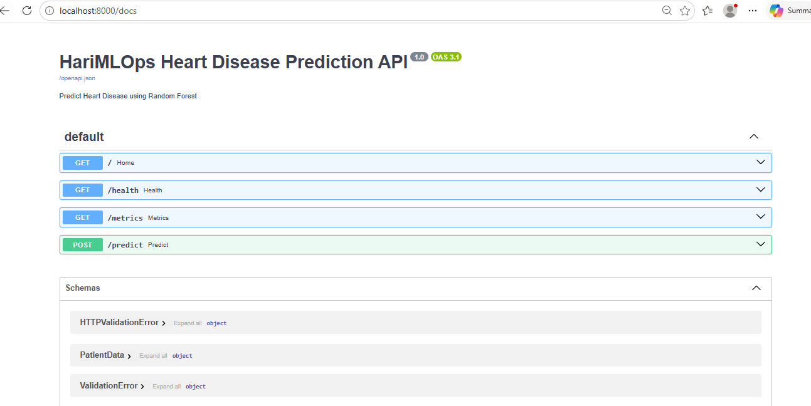
---
# Docker
Commands used to Build Docker Image
    docker build -t heart-disease-api .

Run Docker Container
    docker run -p 8000:8000 heart-disease-api

List Running Containers
    docker ps

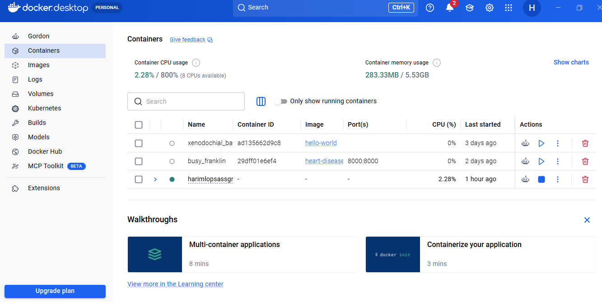
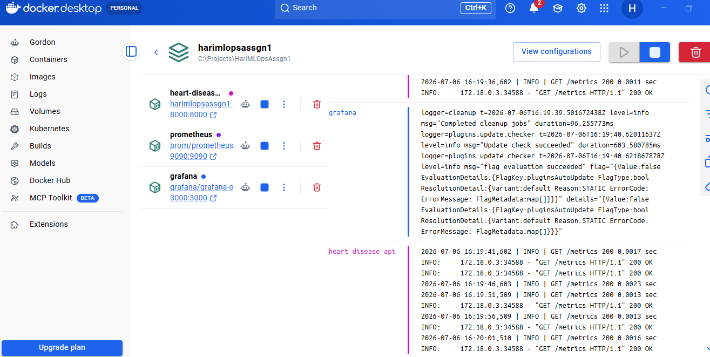
---
# Google Cloud Deployment
    The Docker image is pushed to Google Artifact Registry and deployed using Google Cloud Run.

    Deployment Steps:

        docker build
        docker tag
        docker push
        gcloud run deploy

    Cloud Run Service URL:
    https://heart-disease-api-985530495653.asia-south1.run.app

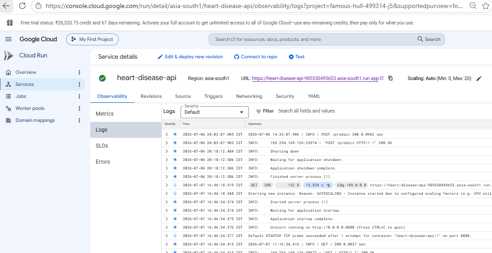
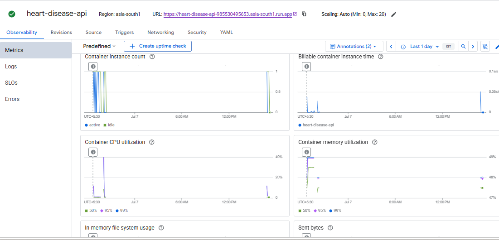
---
# Kubernetes
Kubernetes manifests included:

    Deployment
    Service

Deploy locally:

    kubectl apply -f k8s/deployment.yaml
    kubectl apply -f k8s/service.yaml

Verify:

    kubectl get pods
    kubectl get svc
    kubectl get deployments

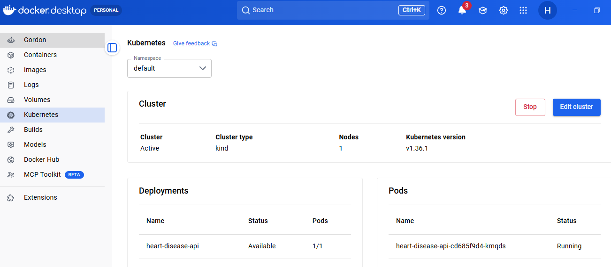
---
# Monitoring (Prometheus & Grafana)
Prometheus

    Prometheus scrapes API metrics.

    Run:
    docker compose up

    Open:
    http://localhost:9090

    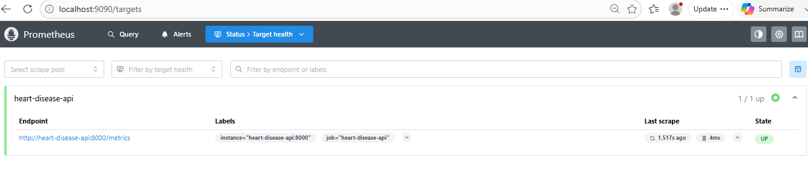
Grafana

    Grafana visualizes metrics.

    Open:
    http://localhost:3000

    Default Login
        admin
        admin
    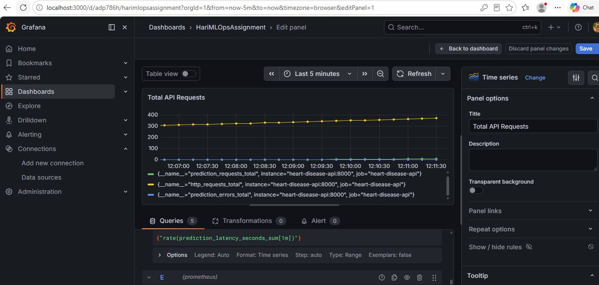
---
# Testing
Unit tests were implemented using Pytest.

    Execute:
        python -m pytest

    Result:
        5 tests passed successfully

    Tests include:
        API Testing
        Model Loading
        Pipeline Validation
    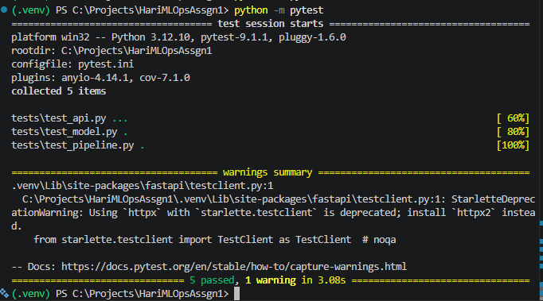
---
# Code Quality
Run Flake8:
    python -m flake8 src api tests

Flake8 checks:
    PEP8 compliance
    Formatting
    Imports
    Unused variables
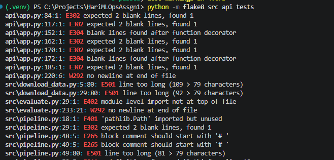
---
# GitHub Actions CI/CD
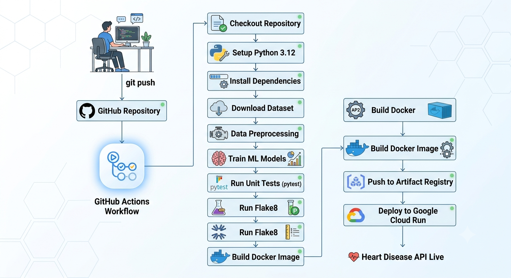
Pipeline stages:

        Push Code
        ↓
        Install Dependencies
        ↓
        Download Dataset
        ↓
        Preprocess Dataset
        ↓
        Train Model
        ↓
        Run Pytest
        ↓
        Run Flake8
        ↓
        Build Docker Image
        ↓
        Deploy
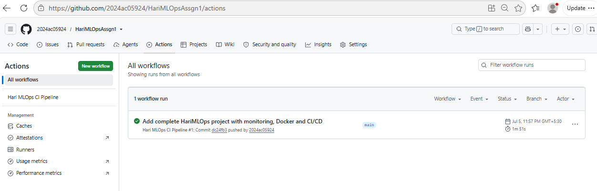
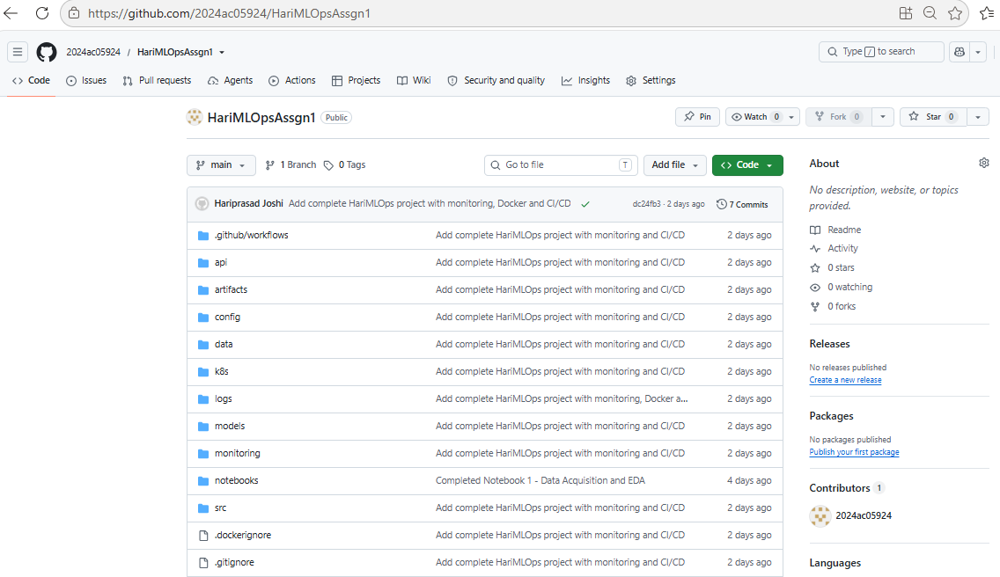
---
# Results
Successfully implemented:
    End-to-End ML Pipeline
    MLflow Experiment Tracking
    REST API using FastAPI
    Docker Containerization
    Google Cloud Deployment
    Kubernetes Deployment Manifests
    Prometheus Monitoring
    Grafana Dashboard
    Automated Unit Testing
    CI/CD Pipeline
---
# Future Improvements
Possible future enhancements include:

    Model Registry using MLflow
    Continuous Model Retraining
    Feature Store Integration
    Kubernetes Deployment on Google Kubernetes Engine (GKE)
    Load Balancing
    Horizontal Pod Autoscaling
    Model Drift Detection
---   
# References
    UCI Machine Learning Repository
    Scikit-learn Documentation
    FastAPI Documentation
    MLflow Documentation
    Docker Documentation
    Kubernetes Documentation
    Google Cloud Documentation
    Prometheus Documentation
    Grafana Documentation
---
# Author
Project: Heart Disease Prediction using MLOps
By: Hariprasad joshi ID: 2024AC05924

    Developed as part of an MLOps assignment demonstrating the complete Machine Learning lifecycle from data ingestion to cloud deployment, monitoring, testing, and CI/CD automation.
---